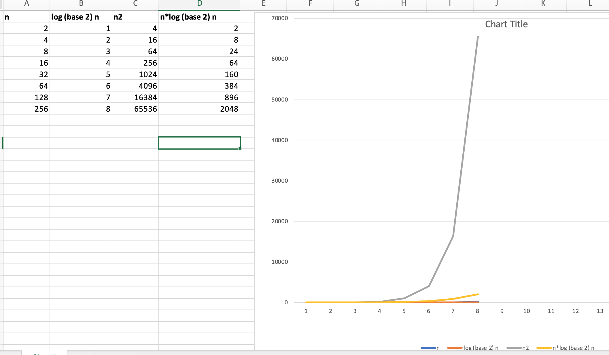

##Maths Formulas:
#####Log:
```
log (base 10) 1    = 0  [log (base 10) 10^0]
log (base 10) 10   = 1  [log (base 10) 10^1]
log (base 10) 100  = 2  [log (base 10) 10^2]
log (base 10) 1000 = 3  [log (base 10) 10^3]
``` 

```
log (base 2) 1  = 0  [log (base 2) 2^0]
log (base 2) 2  = 1  [log (base 2) 2^1]
log (base 2) 4  = 2  [log (base 2) 2^2]
log (base 2) 8  = 3  [log (base 2) 2^3]
``` 

```
log n of base b = x =>  n = b^x

Consider base =2
log n = m
=> n = 2^m


x = 2 ^ n
log x = log (2 ^n)
log x = n log-2
log x = n 

```

#####Summetion of N: `1+ 2+ ... + n = n(n+1) / 2`


###Notations:
#####Comaparison:



##### [Theta] Θ-Notation:
```
Θ(g(n)) = f(n) 
          : 0 􏰎 <= c1*g(n) 􏰎 <= f(n) 􏰎 <= c2*g(n) 
          : for all n 􏰃 >= n0
```
> For point n >= n0, f(n) is always in **BETWEEN** c1*g(n) and c2*g(n).


##### [Big-Oh/Oh] O-Notation:
```
O(g(n)) = f(n) 
          : 0 􏰎 <= f(n) 􏰎 <= c*g(n) 
          : for all n 􏰃 >= n0
```
> For point n >= n0, f(n) is always on or **BELOW** c*g(n).

##### [Omega] Ω-Notation:
```
Ω(g(n)) = f(n) 
          : 0 􏰎 <= c*g(n)  <= f(n) 
          : for all n 􏰃 >= n0
```
> For point n >= n0, f(n) is always on or **ABOVE** c*g(n).


